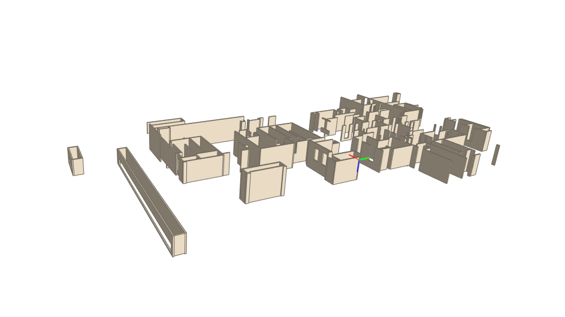
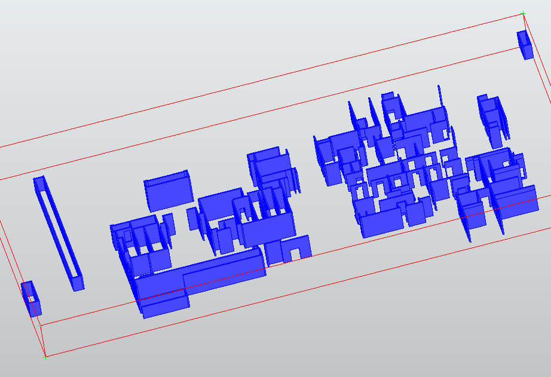

# todo：
1. 是否要将ifc转为mesh，然后针对性地开展城市形态学指标计算  
2. 文件分割还是太慢，考虑用mapreduce对ifc文件分成product-level方法  
# done：
~~1. IFC信息提取位置和构形数据,meta-data,并且提取空间组织关系实体。~~   
~~2. 提取的IFC文件可以在bimvision打开~~  
~~3. 学习occtPython,draw an boundingbox.~~  
~~4. 测试多个instance提取~~      
~~5. 多个构件的包围盒加载显示~~  
~~6, 体积、面积基于opencascade完成~~  

测试总结：
2MB(2000KB)的建筑文件，2.4w行文本记录：提取出来200+IfcWall，文件大小290kb，压缩为15%，花费20分钟，大概3000行记录。

